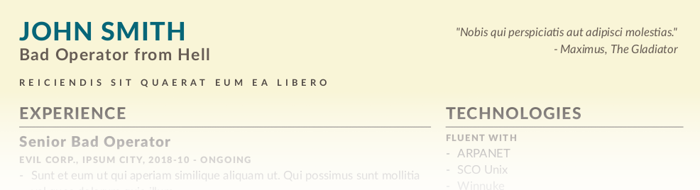

# One Page Resume generator using Base16 themes

A simple resume generator using [Base16](https://github.com/chriskempson/base16), Pandoc and Jinja.
Includes [reset.css](https://meyerweb.com/eric/tools/css/reset/) released as Public Domain.



[Rendered HTML example](https://fdziarmagowski.github.io/opr/)

## Requirements

- [Python](https://www.python.org/)
- [GitPython](https://github.com/gitpython-developers/GitPython)
- [Jinja](https://jinja.palletsprojects.com/en/2.11.x/)
- [Pandoc](https://pandoc.org/) to render Markdown templates from _content_ directory
- Chromium to render PDF
- [tidy](http://www.html-tidy.org/) to verify created HTML

## Usage

```sh
# render HTML and PDF using Base16 Monokai theme
./build.py -s monokai

# render using random Base16 theme
./build.py -r

# list available Base16 themes
./build.py -l
```
